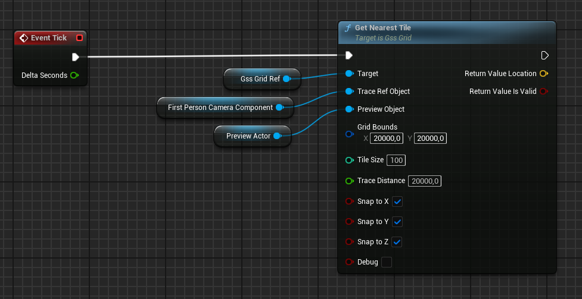

# Unreal Engine - Grid Snap Logic

The `GetNearestTile` function finds and snaps an object to the nearest tile on the grid based on the provided parameters.

#### Blueprint Function




#### Header Declaration

```cpp
FTile GetNearestTile(
    UObject* TraceRefObject,
    UObject* PreviewObject = nullptr,
    FVector2D GridBounds = FVector2D(20000.0f, 20000.0f),
    int32 TileSize = 100,
    float TraceDistance = 10000.0f,
    bool bSnapToX = true,
    bool bSnapToY = true,
    bool bSnapToZ = true,
    bool bDebug = false);
```

#### Function Parameters

| **Parameter**      | **Description**                                                                                     |
|---------------------|-----------------------------------------------------------------------------------------------------|
| **TraceRefObject**  | Reference object used as the starting point for the line trace. |
| **PreviewObject**   | *(Optional)* Object to move or preview.                                    |
| **GridBounds**      | Maximum size of the grid in the X and Y directions. Default: `(20000.0f, 20000.0f)`.            |
| **TileSize**        | Size of each grid tile. Default: `100`.                                                         |
| **TraceDistance**   | Maximum distance the function will trace to find a tile. Default: `10000.0f`.                   |
| **bSnapToX**        | Whether to snap the object to the X-axis of the grid. Default: `true`.                              |
| **bSnapToY**        | Whether to snap the object to the Y-axis of the grid. Default: `true`.                              |
| **bSnapToZ**        | Whether to snap the object to the Z-axis of the grid. Default: `true`.                              |
| **bDebug**          | Whether to enable debugging. Default: `false`.  |
